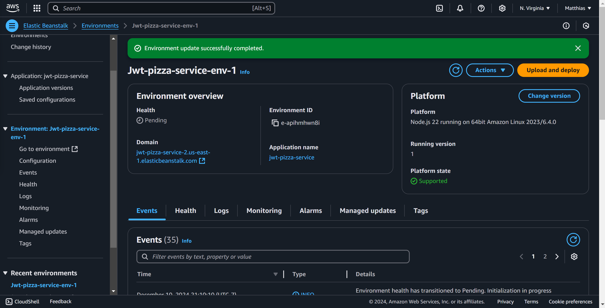

# My Curiosity Report

## Topic: Elastic Beanstalk AWS Service
Trying to deploy JWT-PIZZA-SERVICE with as an elastic beanstalk webapp

Why?
- Auto Load Balancing
- Container Management
- Less Configuration
- Doesn't Need Docker

What I did:

add config.js to elb secrets as a json object
modify config.js to read form environment variable
```
const config = JSON.parse(process.env.CONFIG_JS);
module.exports = config;
```

Zip up application:
`zip -r my-eb-app.zip . -x "node_modules/*" ".git/*" "dist/*" `

### AWS Steps
1. Navigate to Elastic Beanstalk
2. Go to Environments
3. Create Environment
4. create and use new IAM Role for elb
5. Platform: Node.js
6. Upload your code, select Local File, select my-eb-app.zip
7. EC2 Security Groups: jwt-pizza-service
8. Choose Single instance or Load balancer
    - Choosing Load Balancer automatically make you a load balancer
    - Also lets you choose min and max instances
9. I chose arm64 for the new AWS Graviton2 processors
10. Add Environment property 
    `CONFIG_JS = {jwtSecret: "" ... } `
    - put config file here


## What I achieved
I was able to deploy jwt-pizza-service to AWS elastic beanstalk


## Take-aways
1. Learned about AWS Elastic Beanstalk
2. Learn about application load balancers
3. Learned about Instance Profiles
4. Used the AWS cli